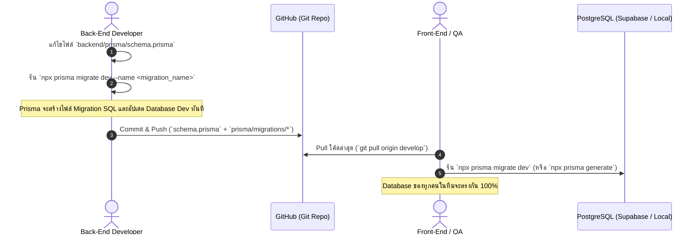

# 🌳 Git Workflow & Team Collaboration Guide
## แนวทางการจัดการทีมและรวมงาน (React บน Firebase Hosting, Node.js + Prisma บน Cloud Run, PostgreSQL)

เอกสารนี้สรุปแนวทางปฏิบัติที่ดีที่สุด (Best Practices) สำหรับทีม 4 คน เพื่อให้การพัฒนา **React (Firebase Hosting)**, **Node.js + Prisma (Google Cloud Run)** และ **PostgreSQL (Supabase Dev ➔ Cloud SQL Prod)** ทำงานร่วมกันได้อย่างราบรื่น

---

## 📁 1. โครงสร้าง Repository (Monorepo with Docker & Prisma)

```text
MatchStock/
├── .github/
│   └── workflows/
│       ├── frontend-firebase.yml  # Auto-deploy React to Firebase Hosting
│       └── backend-cloudrun.yml   # Build Docker & Deploy Node.js to Cloud Run
├── frontend/                      # React (Vite + TypeScript)
│   ├── src/
│   ├── firebase.json              # Firebase Hosting Configuration
│   ├── .firebaserc                # Firebase Project Aliases (Dev / Prod)
│   ├── package.json
│   └── .env.example
├── backend/                       # Node.js Application (Express/NestJS)
│   ├── src/
│   ├── prisma/                    # 💎 Prisma Configuration & Migrations
│   │   ├── schema.prisma          # Database Models, Relations, Indexes
│   │   ├── migrations/            # SQL Migration History (Auto-generated)
│   │   └── seed.ts                # Test Data Seeder
│   ├── Dockerfile                 # Multi-stage Dockerfile สำหรับ Cloud Run
│   ├── .dockerignore
│   ├── package.json
│   └── .env.example
├── docs/                          # API Specs (Swagger/OpenAPI), ERD, Workflows
│   └── openapi.yaml
├── .gitignore
├── README.md
└── PROJECT_PLAN.md
```

---

## ☁️ 2. Back-End Deployment บน Google Cloud Run

### ตัวอย่าง `backend/Dockerfile` (Multi-stage Build น้ำหนักเบา):
```dockerfile
# Stage 1: Build
FROM node:20-alpine AS builder
WORKDIR /app
COPY package*.json ./
COPY prisma ./prisma/
RUN npm ci
RUN npx prisma generate
COPY . .
RUN npm run build

# Stage 2: Production Runner
FROM node:20-alpine AS runner
WORKDIR /app
ENV NODE_ENV=production
COPY package*.json ./
RUN npm ci --only=production
COPY --from=builder /app/node_modules/.prisma ./node_modules/.prisma
COPY --from=builder /app/node_modules/@prisma ./node_modules/@prisma
COPY --from=builder /app/dist ./dist
COPY --from=builder /app/prisma ./prisma

EXPOSE 8080
CMD ["npm", "run", "start:prod"]
```

### GitHub Actions Workflow (`backend-cloudrun.yml`):
* เมื่อ Merge เข้า `develop`:
  1. สร้าง Docker Image
  2. รัน `npx prisma migrate deploy` ไปยัง Supabase PostgreSQL
  3. Deploy ไปยัง Google Cloud Run (Service: `matchstock-api-staging`)

---

## 🔥 3. Front-End Deployment บน Firebase Hosting

### GitHub Actions Workflow (`frontend-firebase.yml`):
* เมื่อ Merge เข้า `develop`:
  1. รัน `npm run build` ในโฟลเดอร์ `frontend/`
  2. Deploy ขึ้น **Firebase Hosting (Staging Channel)**
  3. แจ้งเตือน URL ให้ทีมและ **QA เข้าทดสอบได้ทันที**

---

## 💎 4. Prisma Database Migration Workflow ผ่าน Git

> ⚠️ **กฎเหล็ก:** ห้ามแก้ไข Database บน Supabase GUI หรือ Cloud SQL โดยตรง ทุกการเปลี่ยนแปลงของ Database ต้องทำผ่าน `schema.prisma` และบันทึกเป็น Migration File ลง Git เสมอ



### คำสั่ง Prisma สำคัญที่ทุกคนในทีมต้องทราบ:
1. **เมื่อ Back-End แก้ไขโมเดลฐานข้อมูล:**
   ```bash
   cd backend
   npx prisma migrate dev --name add_barcode_and_lots
   ```
2. **เมื่อ Front-End หรือ QA ดึงโค้ดล่าสุดจาก Git:**
   ```bash
   cd backend
   npx prisma migrate dev      # รัน migration ที่เพื่อนสร้าง
   npx prisma generate         # อัปเดต Types ของ Prisma Client
   ```
3. **เปิดดูข้อมูล Database ผ่าน GUI (Prisma Studio):**
   ```bash
   npx prisma studio           # เปิดดูข้อมูลผ่าน Browser ที่ localhost:5555
   ```

---

## 🌿 5. กลยุทธ์การแตกกิ่ง Git (Branching Strategy)

```
[ main ] ───────────────────────────────────────────────●─── (Prod: Firebase Prod + Cloud Run + Cloud SQL)
   │                                                    ▲
   └──► [ develop ] ────────●─────────────●─────────────┘─── (Staging: Firebase Staging + Cloud Run + Supabase)
             │              ▲             ▲
             ├──► [ feature/be-prisma-auth ]─┘
             └──► [ feature/fe-gr-scanner  ]─┘
```

1. **`main`:** โค้ด Production ที่ผ่าน QA Sign-off (Firebase Prod + Cloud Run Prod + Cloud SQL)
2. **`develop`:** โค้ด Staging สำหรับ QA ทดสอบ (Firebase Staging + Cloud Run Staging + Supabase)
3. **`feature/<role>-<module-name>`:** แตก Branch ออกไปทำงาน เช่น:
   * `feature/be-prisma-stock-engine` (Back-End ทำระบบสต็อกใน Prisma)
   * `feature/fe-cycle-count-screen` (Front-End ทำหน้านับสต็อกบน React)

---

## 🔍 6. Checklist การเปิด Pull Request (PR)

ก่อนกดยืนยัน Merge PR เข้า `develop`:
* [ ] โค้ดผ่านการรัน Lint และ Type Check (`npm run lint`, `tsc --noEmit`)
* [ ] หากมีการแก้ Schema ต้องแนบโฟลเดอร์ `backend/prisma/migrations/` มาใน PR ด้วย
* [ ] ทุก Prisma Query ใน Back-End ต้องมี Filter `tenant_id` เสมอ
* [ ] มีการอัปเดตไฟล์ `docs/openapi.yaml` หากมีการเปลี่ยนโครงสร้าง API
* [ ] ได้รับการ Review & Approve จากเพื่อนร่วมทีมอย่างน้อย 1 คน
