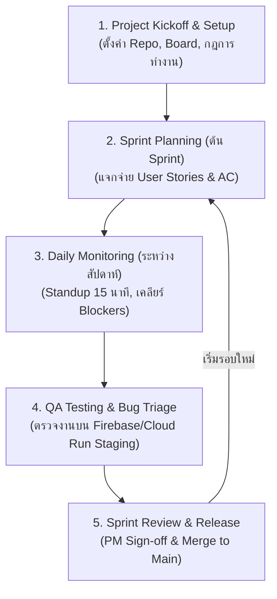

# 👔 MatchStock - PM & SA Execution Playbook
## คู่มือปฏิบัติงานทีละขั้นตอน (Step-by-Step) สำหรับ Project Manager & System Analyst

คู่มือนี้ออกแบบมาเพื่อให้ **PM + SA** สามารถนำทีม 4 คน (PM/SA, Front-End, Back-End, QA) บริหารงานได้อย่างเป็นมืออาชีพ ตั้งแต่วันแรก (Day 1) จนถึงวันปล่อยระบบ (Go-Live)

---

## 🧭 ภาพรวมกระบวนการทำงานของ PM (PM Workflow Lifecycle)



---

## 📍 Phase 1: การเตรียมตัวและเริ่มโปรเจกต์ (Day 1 - Week 1)

### Step 1.1: สร้างและตั้งค่า GitHub Repository
- [ ] สร้าง Repository บน GitHub และนำไฟล์โครงสร้างโปรเจกต์ขึ้น Repo
- [ ] สร้าง 2 Branch หลัก: `main` และ `develop`
- [ ] **ตั้งค่า Branch Protection Rules บน GitHub Settings:**
  - `main` และ `develop`: ติ๊กเลือก **"Require a pull request before merging"** และ **"Require at least 1 approval"**
  - ไม่อนุญาตให้ใคร `git push` ตรงเข้า `main` และ `develop`

### Step 1.2: สร้าง Task Management Board (GitHub Projects / Trello / Jira)
สร้าง Column มาตรฐาน 5 ช่อง:
1. **📋 Backlog:** รายการงานทั้งหมดในระบบ
2. **🎯 Sprint Backlog (To Do):** งานที่ต้องทำใน Sprint ปัจจุบัน
3. **⏳ In Progress:** งานที่ Dev กำลังทำ
4. **🧪 In QA / Testing:** งานที่ Deploy ขึ้น Staging แล้ว กำลังรอ QA ทดสอบ
5. **✅ Done (Passed):** งานที่ QA ตรวจสอบผ่านแล้ว และพร้อม Release

### Step 1.3: จัดประชุม Kickoff Meeting (1 ชั่วโมง)
1. สรุปภาพรวมระบบจาก [PROJECT_PLAN.md](PROJECT_PLAN.md)
2. ชี้แจง Tech Stack: React (Firebase), Node.js + Prisma (Cloud Run), PostgreSQL (Supabase)
3. ตกลงกฎการทำงาน Git จาก [GIT_COLLABORATION_GUIDE.md](GIT_COLLABORATION_GUIDE.md)

---

## 🏃 Phase 2: ขั้นตอนการรันแต่ละ Sprint (รอบละ 2 สัปดาห์)

```
สัปดาห์ที่ 1                                      สัปดาห์ที่ 2
จันทร์       อังคาร - ศุกร์                        จันทร์ - พุธ      พฤหัสบดี       ศุกร์
┌──────────┬─────────────────────────────────────┬──────────────┬──────────────┬──────────────┐
│ Planning │ Dev พัฒนา & Unit Test               │ รวมงานเข้า    │ QA ทดสอบเต็ม │ Review, Demo │
│ & Assign │ (Daily Standup ทุกเช้า 15 นาที)    │ Staging      │ & แก้บั๊ก     │ & Release    │
└──────────┴─────────────────────────────────────┴──────────────┴──────────────┴──────────────┘
```

### 🗓️ วันที่ 1 (จันทร์ สัปดาห์ที่ 1): Sprint Planning
* **หน้าที่ PM:**
  1. ดึง Ticket จาก Backlog เข้ามาใน Sprint ปัจจุบัน
  2. อธิบาย Acceptance Criteria (AC) ให้ทีมฟัง
  3. มอบหมาย Ticket ให้แต่ละคน (ดูตัวอย่าง Ticket ด้านล่าง)

### 🗓️ วันที่ 2 - 7: Execution & Daily Standup
* **หน้าที่ PM (ทุกเช้า 10:00 น. ใช้เวลาไม่เกิน 15 นาที):**
  * ถามทีม 3 คำถาม:
    1. *เมื่อวานทำอะไรเสร็จไปบ้าง?*
    2. *วันนี้จะทำอะไรต่อ?*
    3. *ติดปัญหา (Blocker) ตรงไหนไหมที่ต้องการให้ช่วยเคลียร์?*
  * **หน้าที่ SA:** ถ้า Front-End หรือ Back-End ติดปัญหาเรื่อง Data Type หรือ API Spec ให้ SA ช่วยตัดสินใจและอัปเดต Swagger Specs ทันที

### 🗓️ วันที่ 8 - 9 (พุธ-พฤหัส สัปดาห์ที่ 2): QA Staging Testing & Bug Triage
* **หน้าที่ PM:**
  1. ตรวจสอบว่า PR ทั้งหมดของ Sprint นี้ถูก Merge เข้า `develop` แล้ว
  2. ยืนยันว่าระบบ CI/CD Deploy ขึ้น **Firebase Staging** และ **Cloud Run Staging** เรียบร้อย
  3. ให้ **QA เริ่มทดสอบตาม Test Cases**
  4. หาก QA เจอบั๊ก ให้เปิด Ticket ป้ายแดง `[BUG]` แล้วมอบหมายให้ Dev คนที่รับผิดชอบแก้ทันที

### 🗓️ วันที่ 10 (ศุกร์ สัปดาห์ที่ 2): Sprint Review & Release
* **หน้าที่ PM:**
  1. ประชุม Demo ให้ทีมดูฟังก์ชันที่ทำเสร็จใน Sprint
  2. ตรวจสอบ **QA Sign-off Report**
  3. เมื่อผ่าน 100% ➔ **PM เป็นคนกด Merge จาก `develop` เข้า `main` เพื่อ Release สู่ Production**
  4. ทำ Sprint Retrospective (15 นาที): อะไรทำได้ดี? อะไรต้องปรับปรุงในรอบถัดไป?

---

## 📋 Phase 3: ตัวอย่าง Ticket สำหรับ Sprint 1 (สามารถ Copy ไปใส่ Board ได้ทันที)

### 🎟️ Ticket 1: [BE-01] Prisma Setup & Database Migration
* **Assignee:** Back-End
* **Description:** นำ `schema.prisma` ไปรันสร้างตารางบน Supabase และเตรียม Script Seed ข้อมูล
* **Acceptance Criteria (AC):**
  - [ ] รัน `npx prisma migrate dev` บน Supabase ผ่าน ไม่มี Error
  - [ ] มีไฟล์ `prisma/seed.ts` สร้างข้อมูล Master (Units, Warehouses, Barcodes) ได้สำเร็จ
  - [ ] สามารถเปิดดูข้อมูลผ่าน `npx prisma studio` ได้

### 🎟️ Ticket 2: [BE-02] Auth API & Tenant Isolation Middleware
* **Assignee:** Back-End
* **Description:** พัฒนา Login API และสร้าง Middleware ดักจับ `tenant_id`
* **Acceptance Criteria (AC):**
  - [ ] POST `/api/v1/auth/login` คืนค่า JWT Token ที่มี `userId`, `tenantId`, `role`
  - [ ] มี Middleware ตรวจสอบ Token และดักไม่ให้ User ค้นหาหรือแก้ไขข้อมูลข้าม Tenant
  - [ ] มี Swagger Documentation สำหรับ Auth API

### 🎟️ Ticket 3: [FE-01] Firebase Hosting Setup & Dashboard Layout
* **Assignee:** Front-End
* **Description:** Setup React App, Tailwind CSS, และโครงหน้า Dashboard
* **Acceptance Criteria (AC):**
  - [ ] เชื่อมต่อ GitHub Actions ให้ Deploy ขึ้น Firebase Hosting เมื่อ Merge เข้า `develop`
  - [ ] หน้า Dashboard มี Sidebar, Topbar แสดงชื่อผู้ใช้งาน และชื่อ Tenant ปัจจุบัน
  - [ ] เมนูใน Sidebar ปรับเปลี่ยนตาม Role ของผู้ใช้งาน

### 🎟️ Ticket 4: [FE-02] Master Data Management Screens
* **Assignee:** Front-End
* **Description:** หน้าจัดการข้อมูลสินค้า (Products), คลังสินค้า (Warehouses) และตำแหน่ง (Bins)
* **Acceptance Criteria (AC):**
  - [ ] ตารางแสดงรายการสินค้าพร้อมระบบค้นหา (Search) และแบ่งหน้า (Pagination)
  - [ ] ฟอร์มเพิ่ม/แก้ไข สินค้า (ระบุ Code, SKU, Barcode, หน่วยนับ, ขนาด, น้ำหนัก)
  - [ ] มีการ Validate ฟอร์มครบถ้วนก่อนยิง API

### 🎟️ Ticket 5: [QA-01] Master Test Plan & Multi-Tenancy Security Tests
* **Assignee:** QA / Tester
* **Description:** จัดทำ Test Matrix และทดสอบระบบความปลอดภัย Multi-Tenant
* **Acceptance Criteria (AC):**
  - [ ] สร้างเอกสาร Test Cases สำหรับ Auth และ Master Data CRUD
  - [ ] ทดสอบยิง API หรือเปิดหน้าเว็บข้าม Tenant แล้วต้องไม่เห็นข้อมูลขององค์กรอื่น 100%
  - [ ] มี Postman Collection สำหรับรัน Regression Test อัตโนมัติ

---

## 💡 สรุป Checklist ประจำวันสำหรับคุณ (PM Daily Routine)

| เวลา | กิจกรรมที่ PM ต้องทำ |
| :--- | :--- |
| **09:45** | เปิดดู Board ตรวจสอบว่ามีงานค้างหรือใครติดปัญหาไหม |
| **10:00** | ประชุม **Daily Standup (15 นาที)** เพื่อรับฟังความคืบหน้า |
| **ระหว่างวัน** | ติดตามการเปิด PR บน GitHub, ประสานงานให้ Dev รีวิวโค้ดกัน |
| **16:30** | ตรวจสอบสถานะการ Deploy บน Staging และประสานงานกับ QA |
