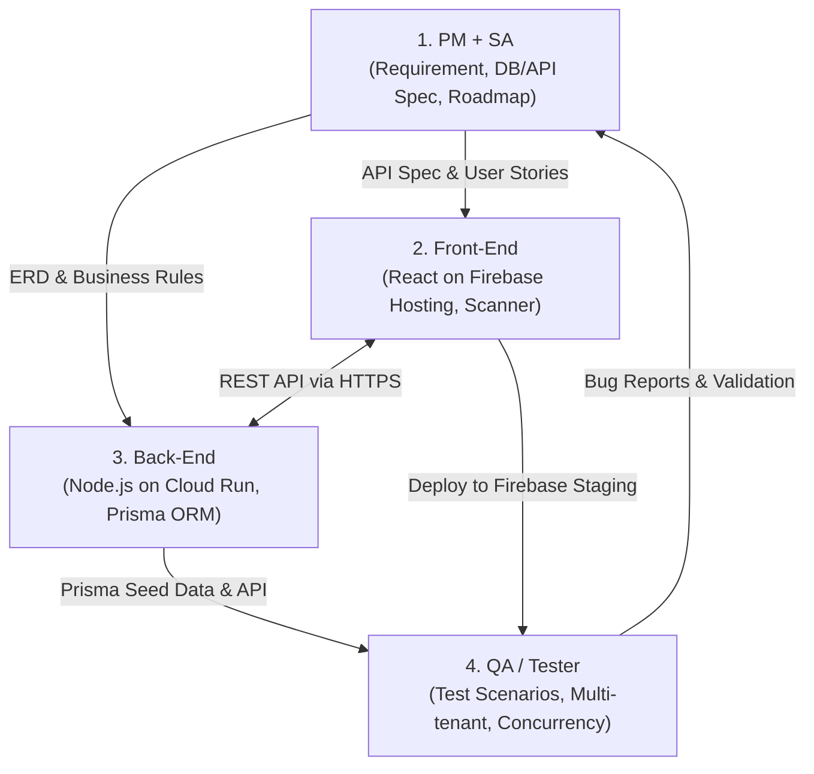

# 📦 MatchStock - Project Architecture & Team Roadmap (4-Person Team)

เอกสารวางแผนสถาปัตยกรรมระบบ, การแบ่งบทบาทหน้าที่ และแผนงานการพัฒนา (Sprint Plan) สำหรับทีม 4 คน
อ้างอิงจาก Requirement ใน `Read Me.md` และโครงสร้างฐานข้อมูลใน `SQL DDL Script.sql`

---

## 🛠️ 1. Technology Stack & Infrastructure

```
┌────────────────────────────────────────────────────────────────────────────────────────┐
│                                   MATCHSTOCK SYSTEM                                    │
└────────────────────────────────────────────────────────────────────────────────────────┘
            │                                                 │
            ▼                                                 ▼
┌───────────────────────────────┐                 ┌───────────────────────────────┐
│     FRONTEND (Client-side)    │                 │      BACKEND (API Server)     │
│  - React (Vite + TypeScript)  │                 │  - Node.js (TypeScript)       │
│  - Tailwind CSS / shadcn/ui   │   REST API      │  - Prisma ORM                 │
│  - React Query + Zustand      │◄───────────────►│  - Containerized (Docker)     │
│  - Barcode / Camera Scanner   │   (JWT / HTTPS) │  - Swagger / OpenAPI Docs     │
│                               │                 │                               │
│  🔥 Hosting: Firebase Hosting │                 │  ☁️ Hosting: Google Cloud Run │
└───────────────────────────────┘                 └───────────────┬───────────────┘
                                                                  │
                                                                  │ Prisma Connection Pool
                                                                  ▼
                                                  ┌───────────────────────────────┐
                                                  │       DATABASE (PostgreSQL)   │
                                                  │  ⚡ Current: Supabase (Dev)   │
                                                  │  🏢 Future:  Google Cloud SQL │
                                                  └───────────────────────────────┘
```

| Layer | Technology | Infrastructure / Hosting | รายละเอียดทางเทคนิค |
| :--- | :--- | :--- | :--- |
| **Frontend** | **React (Vite / TS)** | **Firebase Hosting** | - State: `TanStack Query` + `Zustand`<br>- UI: `Tailwind CSS` / `shadcn/ui`<br>- Scanner: `html5-qrcode` สแกนบาร์โค้ดผ่านกล้องมือถือ<br>- CI/CD: Auto-deploy ผ่าน GitHub Actions สู่ Firebase Preview/Live channels |
| **Backend** | **Node.js (TypeScript)** | **Google Cloud Run** | - Framework: `Express.js` หรือ `NestJS`<br>- **ORM:** `Prisma ORM` (Type-safe, Prisma Migrate, Prisma Studio)<br>- **Container:** `Docker` (Multi-stage build น้ำหนักเบา รวดเร็ว)<br>- **Scalability:** Auto-scaling 0 to N instances, Serverless Container<br>- CI/CD: Build Docker image & Deploy สู่ Cloud Run อัตโนมัติ |
| **Database** | **PostgreSQL** | **Supabase (ช่วงนี้)**<br>➔ **Cloud SQL (อนาคต)** | - **Current Dev:** Supabase PostgreSQL (แยก `DATABASE_URL` และ `DIRECT_URL`)<br>- **Future Prod:** Google Cloud SQL (VPC Connector ร่วมกับ Cloud Run)<br>- ควบคุม Schema & Migrations ทั้งหมดผ่าน `schema.prisma` |
| **Testing & Tools** | **Quality & CI/CD** | **GitHub Actions** | - API Testing: Postman / Newman<br>- Database GUI: Prisma Studio / Supabase Dashboard |

---

## 💎 2. Prisma Database Workflow (Supabase ➔ Cloud SQL)

### การตั้งค่า Connection ใน `schema.prisma`:
```prisma
datasource db {
  provider  = "postgresql"
  url       = env("DATABASE_URL")   // Transaction Pooler (Port 6543)
  directUrl = env("DIRECT_URL")     // Direct Connection (Port 5432) สำหรับรัน Migration
}

generator client {
  provider = "prisma-client-js"
}
```

### Prisma Commands ที่ทีมต้องใช้:
* `npx prisma migrate dev --name <name>` : บันทึกการเปลี่ยนแปลง Schema ลง Git และรันบน Supabase
* `npx prisma db seed` : สร้าง Test Data เริ่มต้นให้ทีม Dev และ QA
* `npx prisma studio` : GUI เปิดดูข้อมูลบน Browser (`localhost:5555`)
* `npx prisma migrate deploy` : คำสั่งสำหรับ CI/CD รัน Migration อัตโนมัติบน Cloud Run / Cloud SQL

---

## 👥 3. บทบาทและความรับผิดชอบของทีม 4 คน (Roles & Responsibilities)



### 1️⃣ คนที่ 1: Project Manager (PM) + System Analyst (SA) - @Arthy001
* **หน้าที่หลัก:**
  - กำหนด Flow การทำงาน, Sequence Diagrams สำหรับ Core Flows (GR, GI, Transfer, Adjustment, Cycle Count)
  - กำหนด **API Contract (Swagger/OpenAPI)** ร่วมกับ Back-End ตั้งแต่ต้น Sprint
### 2️⃣ คนที่ 2: Front-End Developer (React on Firebase Hosting)
* **หน้าที่หลัก:**
  - **Layout & Design System:** Responsive Dashboard พร้อมระบบ Dynamic Menu ตามสิทธิ์ RBAC
  - **โมดูลหน้าจอ (React):**
    - Master Data Management (Products, Warehouses, Bins, Suppliers, Units ฯลฯ)
    - Stock Operations (Goods Receive บันทึก Lot/EXP, Goods Issue พร้อม FIFO Suggest, Stock Transfer, Adjustment)
    - Mobile Barcode Scanner (สแกนผ่านกล้องมือถือ/Handheld)
    - Cycle Count & Variance UI
    - Reports & Analytics: Stock Card, Valuation, Reorder Point Alert Widget
  - **Firebase Hosting Setup:** เชื่อมต่อ GitHub Actions ให้ Auto-deploy ขึ้น Firebase Hosting ทุกครั้งที่มีการอัปเดตโค้ด

---

### 3️⃣ คนที่ 3: Back-End Developer (Node.js on Google Cloud Run + Prisma)
* **หน้าที่หลัก:**
  - **Docker & Cloud Run Setup:** เขียน `Dockerfile` (Multi-stage build) และตั้งค่า Cloud Run Service
  - **Prisma Schema & Migrations:** แปลง `SQL DDL Script.sql` สู่ `schema.prisma` พร้อม Indexes และ Relations
  - **Multi-Tenancy Isolation Middleware:** บังคับ Filter `tenant_id` ในทุก Prisma Query เพื่อความปลอดภัยสูงสุด
  - **Core Inventory Engine (Prisma Transactions):**
    - ใช้ `$transaction` และ Row-level Lock ป้องกัน Race Condition ตอนตัดสต็อกพร้อมกัน
    - Implement FIFO Logic: ค้นหา Lot ที่หมดอายุก่อน (`orderBy: { expiration_date: 'asc' }`)
    - อัปเดต `inventory_balances` แบบ Real-time
    - Cycle Count Variance & Auto-adjustment Service
  - **APIs & Tools:** RESTful APIs ทุกโมดูล, Service Import/Export Excel/CSV, Prisma Seed Data

---

### 4️⃣ คนที่ 4: QA / Tester
* **หน้าที่หลัก:**
  - เขียน Test Cases ครอบคลุม Functional, Non-functional, Boundary, Negative Tests
  - **จุดทดสอบสำคัญ:**
    - **Multi-Tenant Isolation:** ยิง API ข้าม `tenant_id` ต้องถูกบล็อก 100%
    - **Stock Accuracy:** ทดสอบการเคลื่อนไหวสต็อก, กฎ FIFO, ป้องกันสต็อกติดลบ และยอด Stock Card ต้องตรงกับยอด Balance จริง
    - **Concurrency Test:** ทดสอบยิงตัดสต็อกชิ้นสุดท้ายพร้อมกันบน Cloud Run
    - **Hardware & Scanner:** ทดสอบสแกนบาร์โค้ดจริงผ่านกล้องบน Web App
  - ทำ Automated API Test ด้วย Postman / Newman รันใน CI/CD

---

## 🚀 4. แผนการพัฒนาแบบแบ่งรอบ (Sprint Roadmap - 4 Sprints / 8 Weeks)

```
Sprint 1 (W 1-2): Foundation, Docker/Cloud Run, Firebase Setup, Multi-Tenancy & Master Data
Sprint 2 (W 3-4): Core Stock Transactions (GR, GI, Transfer, FIFO Engine)
Sprint 3 (W 5-6): Cycle Count, Barcode Integration & Smart Alerts
Sprint 4 (W 7-8): Reports, Import/Export, Production Readiness (Cloud Run + Cloud SQL Ready)
```

### 🔹 Sprint 1: Foundation, Infrastructure & Master Data (Week 1-2)
* **PM + SA:** สรุป User Stories, สร้าง Swagger Spec สำหรับ Auth & Master Data
* **Back-End:** Setup Node.js + Prisma ORM + Docker, Connect Supabase Postgres, Deploy Staging API ขึ้น Google Cloud Run, Implement JWT Auth & Multi-tenant Middleware, ทำ CRUD APIs สำหรับ Master Data
* **Front-End:** Setup React (Vite) + Tailwind, Setup Firebase Hosting + CI/CD, หน้า Login, Layout Dashboard, ฟอร์มจัดการ Master Data
* **QA / Tester:** เตรียม Master Test Plan, ใช้ Prisma Studio ร่วมกับ Postman ในการ Verify Master Data CRUD บน Cloud Run

---

### 🔹 Sprint 2: Core Stock Transactions & Inventory Engine (Week 3-4)
* **PM + SA:** Sequence Diagram สำหรับ GR, GI, Transfer, Adjustment และกฎ FIFO
* **Back-End:** พัฒนา Core Stock Engine ด้วย Prisma Transaction (`$transaction`), API Goods Receive (สร้าง Lot + เพิ่ม Balance), API Goods Issue (ตัดตาม FIFO), API Transfer ข้ามคลัง/Bin
* **Front-End:** หน้ารับสินค้า (GR), หน้าจ่ายสินค้า (GI), หน้าย้ายสต็อก (Transfer), หน้าดูยอดสต็อก Real-time ตาม Bin
* **QA / Tester:** ทดสอบคำนวณสต็อก, ทดสอบ Concurrency ในการตัดสต็อกพร้อมกันบน Cloud Run, ทดสอบการตัด Lot FIFO

---

### 🔹 Sprint 3: Cycle Count, Barcode Scanner & Smart Alerts (Week 5-6)
* **PM + SA:** Workflow การตรวจนับสต็อก และ Logic การแจ้งเตือน Reorder Point
* **Back-End:** APIs ระบบตรวจนับ (`stock_counts`, `stock_count_items`), API Auto-Adjustment, Endpoints แจ้งเตือน Low Stock & Expiration
* **Front-End:** หน้าจอนับสต็อก Cycle Count, เชื่อมกล้องมือถือสแกน Barcode บน Firebase Web App, หน้า Alert Center บน Dashboard
* **QA / Tester:** ทดสอบ Workflow ตรวจนับและคำนวณ Variance, ทดสอบ Barcode Scan กับอุปกรณ์จริง

---

### 🔹 Sprint 4: Reports, Import/Export & Production Readiness (Week 7-8)
* **PM + SA:** ออกแบบ Layout รายงาน Stock Card & Valuation, เตรียม UAT Script
* **Back-End:** APIs รายงาน Stock Card, Fast/Slow Moving, Import/Export Excel/CSV, ตรวจสอบ Cloud Run Scaling และเตรียมคำสั่ง Deploy สู่ Google Cloud SQL
* **Front-End:** หน้ารายงาน Stock Card & Charts, ระบบ Import/Export Excel, ปรับแต่ง Responsive & Performance
* **QA / Tester:** Full Regression Test, Security & Multi-tenant Penetration Test, Support UAT Sign-off
