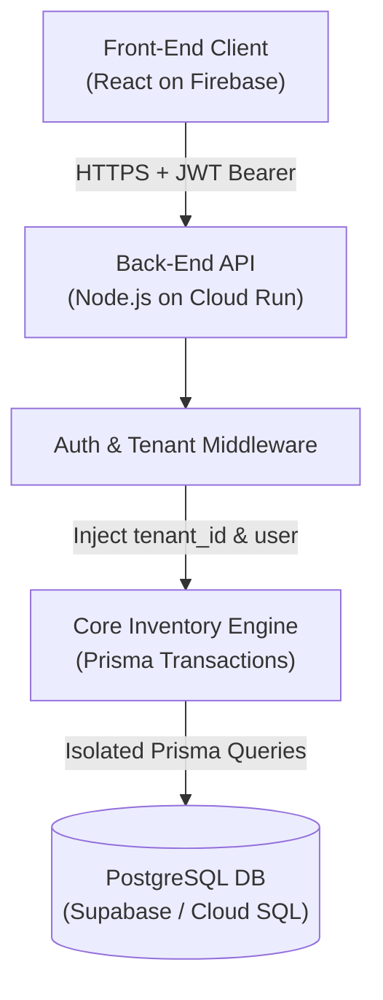
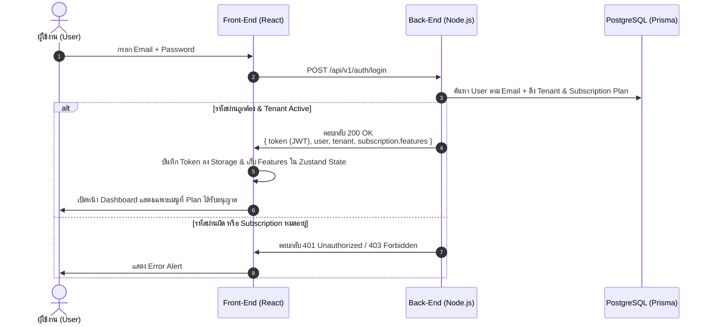
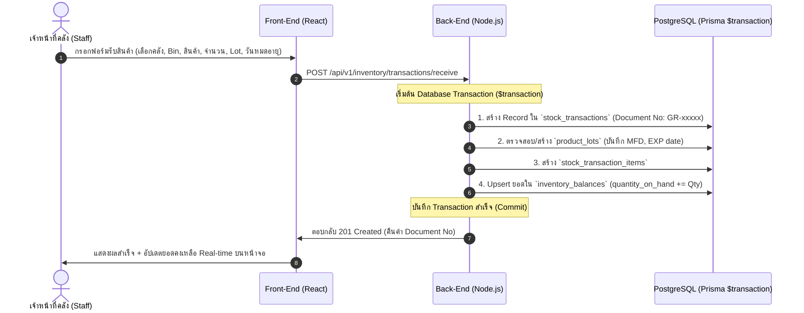
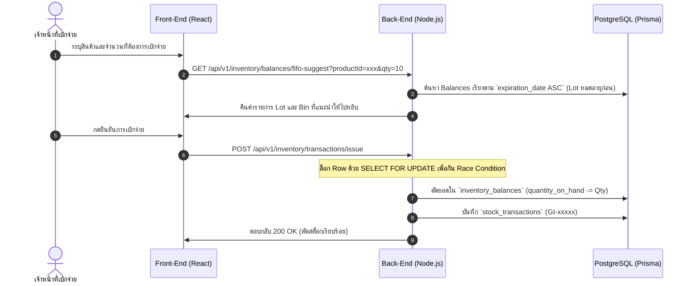

# 📐 MatchStock - System Architecture & Data Flow Specification (SA Document)

เอกสารวิเคราะห์และออกแบบระบบ (System Analysis & Design) จัดทำโดย **SA (System Analyst)**
สำหรับให้อ้างอิงการพัฒนา **Front-End (React)**, **Back-End (Node.js + Prisma)** และ **QA Testing**

---

## 🧭 1. ภาพรวมสถาปัตยกรรม (System Context)



---

## 🔐 2. Authentication & Tenant Resolution Flow

กระบวนการ Login และการดึงสิทธิ์ Feature Flags ของ Subscription เพื่อคุมเมนูบนหน้าจอ:



---

## 📦 3. Data Flow: Goods Receive (GR - บันทึกรับสินค้าเข้าคลัง)

เมื่อมีการรับสินค้าเข้าคลัง จะเกิดการสร้าง **Transaction Item**, สร้าง **Lot Number** (ถ้าเป็นสินค้า Lot Control) และอัปเดตยอดใน **`inventory_balances`**:



---

## 📤 4. Data Flow: Goods Issue (GI - จ่ายสินค้าออกด้วย FIFO Logic)

การตัดสต็อกสินค้าตามลำดับวันหมดอายุ (`expiration_date`) เก่าสุดก่อน:



---

## 📊 5. Standard Response Format มาตรฐานเดียวกันทั้งระบบ

ทุก Endpoint ในระบบ MatchStock จะคืนค่าใน Format เดียวกันเสมอ:

### กรณีสำเร็จ (Success 200/201):
```json
{
  "success": true,
  "data": { ... },
  "message": "Operation completed successfully",
  "meta": {
    "page": 1,
    "limit": 20,
    "totalCount": 105,
    "totalPages": 6
  }
}
```

### กรณีผิดพลาด (Error 400/401/403/404/500):
```json
{
  "success": false,
  "message": "Validation failed / Unauthorized / Not found",
  "errors": [
    "Product code already exists in this tenant",
    "Price cannot be negative"
  ]
}
```
