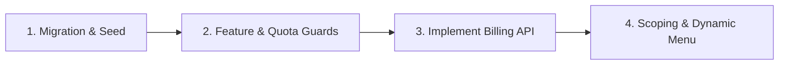
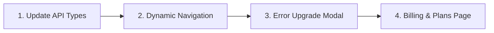

# MatchStock — Backend & Frontend Implementation Guide (Post Schema & OpenAPI Update)

เอกสารแนะนำขั้นตอนการพัฒนา (Hand-off & Implementation Guide) สำหรับทีม **Backend** และ **Frontend** หลังจากที่มีการอัปเดต `schema.prisma` (Subscription Quotas, Menu Feature Gating, Company Scoping) และ `docs/openapi.yaml` (Billing API Contract)

---

## 🛠️ 1. ทีม Backend: สิ่งที่ต้องดำเนินการ (Backend Implementation)



### 1.1 Database Migration & Seeding
1. ดึงโค้ดล่าสุดจาก Git: `git pull origin develop`
2. สร้าง Prisma Client Types ใหม่:
   ```bash
   npm run db:generate
   ```
3. รัน Migration เข้าฐานข้อมูล PostgreSQL:
   ```bash
   npx prisma migrate dev --name add_subscription_quotas_and_company_scoping
   ```
4. Seed ข้อมูลเริ่มต้นของ 3 แพ็กเกจ (`FREE`, `PRO_MONTHLY`, `ULTRA_MONTHLY`):
   ```bash
   npm run db:seed
   ```

### 1.2 พัฒนา Middlewares / Guards (Feature Gating & Quota Limits)
- **`EntitlementGuard` (`@RequireFeature('feature.code')`)**:
  - ดึง `features` จาก `SubscriptionPlan` ของ Tenant ปัจจุบัน
  - หากไม่มีสิทธิ์ ให้ตอบกลับ HTTP `403 Forbidden` พร้อม Payload:
    ```json
    {
      "success": false,
      "error": "FEATURE_NOT_INCLUDED",
      "feature": "stock.fefo",
      "message": "Your current plan does not include this feature. Please upgrade."
    }
    ```
- **Quota Validation (ก่อน Insert ข้อมูลใหม่)**:
  - `UsersService.create()`: ตรวจสอบ `COUNT(users) < plan.maxUsers`
  - `WarehousesService.create()`: ตรวจสอบ `COUNT(warehouses) < plan.maxWarehouses`
  - `ProductsService.create()`: ตรวจสอบ `COUNT(products) < plan.maxProducts`
  - หากเกินโควตา ให้ตอบกลับ HTTP `403 Forbidden` พร้อม Payload:
    ```json
    {
      "success": false,
      "error": "QUOTA_EXCEEDED",
      "resource": "warehouses",
      "currentUsage": 1,
      "maxAllowed": 1,
      "message": "Warehouse limit reached (1/1). Please upgrade your subscription."
    }
    ```

### 1.3 พัฒนา Billing Controllers & Services
- พัฒนา Endpoints ฝั่ง Tenant:
  - `GET /api/v1/billing/plans` — รายการแพ็กเกจทั้งหมดพร้อมเปรียบเทียบฟีเจอร์
  - `GET /api/v1/billing/current-subscription` — สถานะแพ็กเกจปัจจุบัน + Usage/Quota
  - `POST /api/v1/billing/subscribe` — สมัคร/อัปเกรดแพ็กเกจ
  - `POST /api/v1/billing/cancel` — ยกเลิกการต่ออายุแพ็กเกจ
  - `GET /api/v1/billing/invoices` — รายการใบแจ้งหนี้/ใบเสร็จรับเงิน
- พัฒนา Endpoints ฝั่ง Platform Admin:
  - `GET /api/v1/platform/billing/subscriptions` — ดูภาพรวม Subscription ทุกลูกค้า

### 1.4 Company Scoping & Dynamic Menu
- เพิ่มฟิลด์ `companyId` (Optional) ใน DTO และ Service ของ `Warehouse`, `Supplier`, `User`
- ใน `MenuItemsService.getMenuForUser()`: คัดกรองเมนูตาม `MenuItem.requiredFeature` ที่ตรงกับ `SubscriptionPlan.features` ของ Tenant

---

## 🎨 2. ทีม Frontend: สิ่งที่ต้องดำเนินการ (Frontend Implementation)



### 2.1 อัปเดต TypeScript Types / API Client
- นำไฟล์ `docs/openapi.yaml` ไป generate หรืออัปเดต Type Definitions ในโปรเจกต์ Frontend ให้รองรับฟิลด์ใหม่ (`companyId`, Subscription DTOs, Invoices)

### 2.2 ปรับระบบเมนู Sidebar (Dynamic Navigation)
- ตรวจสอบ `subscription.features` จาก Response ตอน Login (`/auth/login` หรือ `/auth/me`)
- ซ่อน/แสดงเมนูและปุ่มคำสั่งตามสิทธิ์ของ Plan ปัจจุบัน (เช่น ซ่อนเมนู RFID / Cycle Count สำหรับผู้ใช้ Plan Free)

### 2.3 จัดการ Error แจ้งเตือนอัปเกรด (Upgrade Prompts)
- สร้าง Modal แจ้งเตือนเมื่อ API ตอบกลับ Error:
  - **`FEATURE_NOT_INCLUDED`**: แสดง Pop-up *"ฟีเจอร์นี้สำหรับแพ็กเกจ Pro และ Ultra เท่านั้น"* พร้อมปุ่มกดไปหน้าอัปเกรด
  - **`QUOTA_EXCEEDED`**: แสดง Pop-up *"คุณใช้งานโควตาเต็มแล้ว (เช่น คลังสินค้า 1/1 แห่ง)"* พร้อมปุ่มกดขยายโควตา

### 2.4 สร้างหน้าจัดการ Subscription & Billing (`/settings/billing` หรือ `/billing`)
1. **Pricing Table**: แสดงการ์ด 3 แพ็กเกจ (🥉 Free, 🥈 Pro, 🥇 Ultra) พร้อมรายการฟีเจอร์และปุ่ม "สมัครใช้งาน"
2. **Current Plan Card**: แสดงชื่อแพ็กเกจปัจจุบัน, วันหมดอายุรอบบิล, หลอด Progress Bar โควตาการใช้งาน (Users, Warehouses, Products)
3. **Invoices Table**: แสดงประวัติใบแจ้งหนี้/ใบเสร็จรับเงิน พร้อมปุ่มดาวน์โหลด

### 2.5 เพิ่มตัวเลือก Company ในฟอร์ม Master Data
- ในหน้าสร้าง/แก้ไข **Warehouse**, **Supplier**, และ **User**:
  - เพิ่ม Dropdown ให้เลือกสังกัดบริษัทย่อย (`Company`) หรือเลือกเป็น *"คลังกลาง / สำนักงานใหญ่"*

---

## 🚀 3. ลำดับขั้นตอนการส่งมอบงาน (Hand-off Matrix)

| เฟส | กิจกรรม | ผู้รับผิดชอบหลัก | ผลลัพธ์ที่ได้ |
|---|---|---|---|
| **Phase 1** | Run Migration DB & Seed Plans | **Backend** | ตารางใน DB อัปเดตพร้อมข้อมูล 3 Plans |
| **Phase 2** | Implement Billing API & Quota Validation | **Backend** | API Billing & Guard พร้อมใช้งาน |
| **Phase 3** | Implement Dynamic Sidebar & Upgrade Modal | **Frontend** | UI ซ่อนเมนูตาม Plan และเตือนเมื่อติดโควตา |
| **Phase 4** | Build Billing & Pricing UI | **Frontend** | หน้าชำระเงินและดูประวัติใบเสร็จพร้อมใช้ |
| **Phase 5** | End-to-End QA Testing | **QA / Tester** | ทดสอบตาม `docs/MASTER_DATA_TEST_PLAN.md` |
