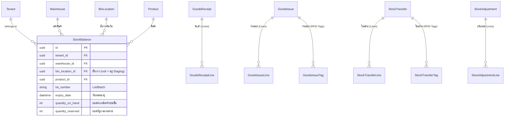

# MatchStock — Hybrid Inventory Architecture (Bulk Barcode & Serialized RFID)

เอกสารสถาปัตยกรรมการบริหารจัดการคลังสินค้าแบบผสมผสาน (Hybrid WMS Architecture) รองรับทั้ง **สินค้าบาร์โค้ดคุมจำนวนเยอะ (Bulk / Quantity-based)** และ **สินค้าติดชิป RFID รายชิ้น (Serialized / RFID-based)**

---

## 🎯 1. ทำไมต้องเป็น Hybrid Inventory Architecture?

ในคลังสินค้าจริง มักมีสินค้า 2 ประเภททำงานร่วมกัน:
1. **สินค้าคุมจำนวนมหาศาล (Bulk Items)**: เช่น น็อต 100,000 ตัว, หน้ากากอนามัย 50,000 ชิ้น, เสื้อผ้า
   - *ปัญหาเดิม*: หากสร้าง Virtual Tag 100,000 แถว จะทำให้ Database บวมและช้ามาก
   - *วิธีแก้*: ใช้ตาราง **`stock_balances`** เก็บเพียง **1 แถวต่อ 1 พิกัดชั้นวาง** บวกลบตัวเลข `quantity_on_hand` ตรงๆ ($O(1)$ Performance)
2. **สินค้าติดชิป RFID / Serialized Items**: เช่น อุปกรณ์ไอที, สินค้าแบรนด์เนม, อะไหล่ราคาสูง
   - *วิธีทำงาน*: ใช้ตาราง **`tags`** และ **`tag_current_state`** แทร็กพิกัดรายชิ้น เพื่อให้เสาอ่าน RFID Portal Gate อ่านข้อมูล 100–500 ชิ้นได้พร้อมกันใน 1 วินาที

---

## 📊 2. แผนภาพสถาปัตยกรรมข้อมูล (Dual-Engine Data Model)



---

## 🔄 3. วงจรธุรกรรมสินค้า 4 ด้าน (Transaction Lifecycle Matrix)

| ธุรกรรม | แบบสินค้าบาร์โค้ดนับจำนวน (Bulk) | แบบสินค้าติดชิป RFID (Serialized) |
|---|---|---|
| **1. รับเข้า (Inbound)** | `goods_receipt_lines` $\rightarrow$ เพิ่มยอด `StockBalance` | `tags` + `tag_current_state` $\rightarrow$ สรุปยอดลง `StockBalance` |
| **2. จัดเก็บ (Putaway)** | ย้ายยอดใน `StockBalance` จาก `bin: null` $\rightarrow$ `bin: A-01` | อัปเดต `tag_current_state.last_bin_location_id` |
| **3. โอนย้าย (Transfer)** | `stock_transfer_lines` (ลดต้นทาง, เพิ่มปลายทางใน `StockBalance`) | `stock_transfer_tags` (เปลี่ยนพิกัด Tag) |
| **4. ปรับยอด (Adjust)** | `stock_adjustment_lines` (ปรับ `quantity_on_hand` +/-) | `cycle_count_tags` (ตรวจนับ Tag หาย/พบใหม่) |
| **5. จ่ายออก (Outbound)** | `goods_issue_lines` (ลด `StockBalance.quantity_on_hand`) | `goods_issue_tags` (`tag_current_state.status = 'exited'`) |

---

## 💡 4. การเรียกดูยอดสต็อก (Querying Stock Balance)

ไม่ว่าจะเป็นสินค้าประเภทใด หน้าจอและ API สามารถดึงยอดคงเหลือได้อย่างรวดเร็วจาก **`stock_balances`**:

```sql
-- ดึงยอดคงเหลือรวมในคลัง
SELECT SUM(quantity_on_hand) AS total_on_hand,
       SUM(quantity_reserved) AS total_reserved,
       SUM(quantity_on_hand - quantity_reserved) AS available_for_sale
FROM stock_balances
WHERE tenant_id = '...' AND product_id = '...' AND warehouse_id = '...';

-- ดึงยอดแยกรายชั้นวาง (Stock by Bin)
SELECT bin_location_id, lot_number, expiry_date, quantity_on_hand
FROM stock_balances
WHERE tenant_id = '...' AND product_id = '...' AND quantity_on_hand > 0;
```
