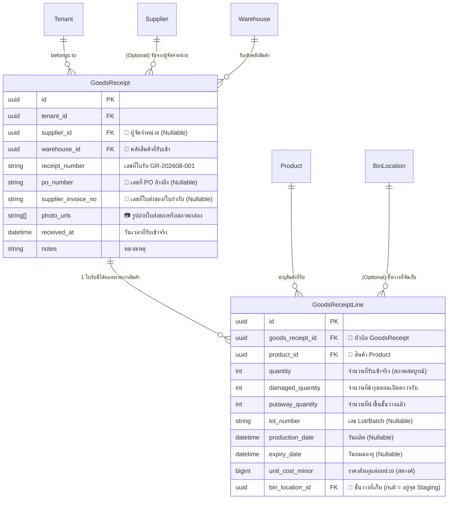
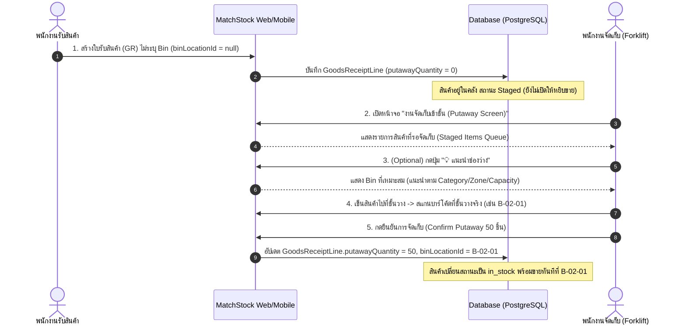

# MatchStock — Goods Receiving & Flexible Putaway System Design

เอกสารสถาปัตยกรรมและการออกแบบระบบ **การรับสินค้าเข้าคลัง (Goods Receiving)** และ **การจัดเก็บเข้าชั้นวาง (Flexible Putaway)** สำหรับระบบ MatchStock WMS & Inventory Management Platform

---

## 🎯 1. วัตถุประสงค์และหลักการออกแบบ (Core Objectives)

1. **รองรับแหล่งที่มาของสินค้าครบ 100%**:
   - รับจากการสั่งซื้อ (มี PO Number / ใบส่งของ Supplier Invoice No.)
   - รับจาก Supplier โดยไม่มี PO (ของแถม / สินค้าตัวอย่าง)
   - รับคืนสินค้าจากลูกค้า (Customer Returns / เคลมสินค้า)
   - รับสินค้าผลิตเองภายในโรงงาน (Finished Goods Inbound)
   - ยกยอดสต็อกเริ่มต้นวันแรก
2. **ความยืดหยุ่นสูงสุดในการจัดเก็บ (Flexible Putaway)**:
   - **1-Step (Direct Receiving)**: รับเข้าและระบุชั้นวาง (Bin Location) จบในขั้นตอนเดียว สำหรับคลังขนาดเล็กหรือสินค้าที่มีที่เก็บประจำ
   - **2-Step (Receiving & Putaway)**: รับเข้าพักที่จุดรับสินค้า (Receiving Staging Dock) $\rightarrow$ พนักงานเข็นไปสแกนบาร์โค้ดชั้นวางจริงที่วาง (Manual Scan-to-Confirm)
   - **Suggested Putaway Helper**: มีปุ่มตัวช่วยแนะนำช่องวางที่เหมาะสมตาม Category, Zone, และ Capacity (ไม่บังคับ สามารถ Override หน้างานได้เสมอ)
3. **การติดตามสินค้าแบบละเอียด (Traceability)**:
   - รองรับการบันทึก Lot Number, วันผลิต (MFG), วันหมดอายุ (EXP), ราคาต้นทุนจริง
   - บันทึกจำนวนสินค้าชำรุดจากการตรวจรับ (`damagedQuantity`) เพื่อเคลมกับ Supplier
   - แนบรูปถ่ายใบส่งของหรือสภาพสินค้า (`photoUrls`)

---

## 📊 2. แผนภาพสถาปัตยกรรมข้อมูล (Data Model & ER Diagram)

---

## 🔄 3. ผังขั้นตอนการทำงานหน้างานจริง (Operational Workflows)

### 3.1 รูปแบบที่ 1: รับเข้าพร้อมวางชั้นทันที (1-Step Direct Receiving)
> เหมาะสำหรับคลังขนาดเล็ก หรือสินค้าที่พนักงานรู้ตำแหน่งจัดเก็บแน่นอนอยู่แล้ว

1. พนักงานเปิดหน้าจอ **"รับสินค้าเข้าคลัง (Goods Receipt)"**
2. เลือกคลังสินค้า (`warehouseId`), เลือกผู้ขาย (`supplierId` ถ้ามี), กรอกเลข PO/ใบส่งของ (ถ้ามี)
3. สแกนบาร์โค้ดสินค้า $\rightarrow$ กรอกจำนวน $\rightarrow$ ระบุ **ชั้นวาง (Bin Location)** เช่น `A-01-01`
4. กดยืนยัน:
   - บันทึก `GoodsReceipt` และ `GoodsReceiptLine`
   - สินค้ามีสถานะเป็น `in_stock` พร้อมขาย/พร้อมหยิบทันทีที่พิกัด `A-01-01`
   - `putawayQuantity` = `quantity`

---

### 3.2 รูปแบบที่ 2: รับเข้าพัก Staging แล้วแยกไปจัดเก็บ (2-Step Receiving & Putaway)
> เหมาะสำหรับศูนย์กระจายสินค้า หรือคลังขนาดใหญ่ที่มีจุดพักรับสินค้า (Receiving Dock)

---

## 🔀 4. การจัดการกรณีพิเศษหน้างาน (Edge Cases)

### 4.1 การแยกเก็บหลายชั้นวาง (Partial Putaway / Multi-Bin Storage)
* **สถานการณ์**: รับเมาส์มา 100 ชิ้น แต่ช่อง `A-01-01` ใส่ได้แค่ 60 ชิ้น
* **การทำงาน**:
  1. พนักงานสแกนช่อง `A-01-01` ระบุจำนวน **60 ชิ้น** $\rightarrow$ กดยืนยัน
  2. ในคิวจัดเก็บจะเหลือจำนวนค้างอยู่อีก **40 ชิ้น**
  3. พนักงานเข็นไปสแกนช่อง `A-01-02` ระบุจำนวน **40 ชิ้น** $\rightarrow$ กดยืนยัน
  4. ใบรับสินค้านี้ปิดงานสมบูรณ์ (`putawayQuantity == quantity`)

### 4.2 การสแกนเปลี่ยนช่องวางหน้างาน (Bin Override)
* ระบบเป็นแบบ **Soft Suggestion**: ต่อให้ระบบแนะนำช่อง `A-01-01` แต่ถ้าหน้างานมีพาเลทอื่นวางขวางอยู่ พนักงานสามารถ **สแกนช่อง `B-02-01` ได้ทันที** โดยระบบจะยอมรับและบันทึกพิกัดใหม่ให้อัตโนมัติ ไม่มีการบล็อกหน้างาน

### 4.3 การบันทึกสินค้าชำรุด (Damaged / Rejected Items)
* ตอนเปิดตู้คอนเทนเนอร์ พบว่ากล่องสินค้าบุบเสียหาย 5 กล่องจาก 100 กล่อง:
  * บันทึก `quantity: 95` (สินค้าดี เข้าสต็อก)
  * บันทึก `damagedQuantity: 5` (สินค้าเสีย ไม่เข้าสต็อกขาย แต่เก็บประวัติไว้เคลม)
  * แนบรูปถ่ายกล่องที่บุบใน `photoUrls`

---

## 🔌 5. ข้อกำหนด API ที่พร้อมพัฒนา (API Specification)

| Method | Endpoint | รายละเอียด |
|---|---|---|
| `POST` | `/api/v1/goods-receipts` | สร้างใบรับสินค้า (รองรับ Header + Lines, แนบรูป, ระบุ Lot/Exp, รองรับทั้ง 1-Step และ 2-Step) |
| `GET` | `/api/v1/goods-receipts` | รายการใบรับสินค้าทั้งหมด (พร้อมฟิลเตอร์ตามวันที่, Supplier, Warehouse, สถานะ Putaway) |
| `GET` | `/api/v1/goods-receipts/{id}` | รายละเอียดใบรับสินค้าและสถานะการจัดเก็บรายบรรทัด |
| `GET` | `/api/v1/goods-receipts/staged-items` | รายการสินค้าที่รอจัดเก็บ (สำหรับแสดงในหน้าจอ Putaway Mobile/Web) |
| `GET` | `/api/v1/putaway/suggest-bin` | แนะนำช่องจัดเก็บที่ว่างตามหมวดหมู่และความจุ (Optional Helper) |
| `POST` | `/api/v1/putaway/confirm` | สแกนยืนยันการนำสินค้าไปวางบนชั้นวางจริง |

---

## 🧪 6. ชุดการทดสอบคุณภาพ (QA Test Plan for Receiving & Putaway)

- [ ] **GR-01 (Full Inbound)**: รับสินค้าปกติ (มี Supplier, มีเลข PO, มี Lot No., มีวันหมดอายุ) -> บันทึกสำเร็จ
- [ ] **GR-02 (No Supplier / No PO)**: รับสินค้าคืนจากลูกค้า หรือรับของแถม (ไม่ใส่ Supplier, ไม่ใส่ PO) -> บันทึกสำเร็จ
- [ ] **GR-03 (Damaged Items)**: รับสินค้า 100 ชิ้น ชำรุด 2 ชิ้น -> สต็อกพร้อมขายเพิ่ม 98 ชิ้น, ประวัติบันทึกชำรุด 2 ชิ้น
- [ ] **GR-04 (1-Step Direct Putaway)**: รับสินค้าระบุ `binLocationId: A-01-01` ทันที -> สต็อกพร้อมขายที่ `A-01-01` ทันที
- [ ] **GR-05 (2-Step Putaway Flow)**: รับสินค้าไม่ระบุ Bin -> สินค้าเข้าคิว Staged -> พนักงานไปสแกน Bin จริง -> สต็อกอัปเดตถูกต้อง
- [ ] **GR-06 (Partial Putaway)**: รับสินค้า 100 ชิ้น แยกเก็บ 60 ชิ้นที่ Bin A และ 40 ชิ้นที่ Bin B -> สต็อกแยกเข้า 2 Bin ถูกต้อง
- [ ] **GR-07 (Bin Override)**: ระบบแนะนำ Bin A แต่พนักงานสแกนเก็บที่ Bin B -> ระบบยอมรับและบันทึกที่ Bin B
