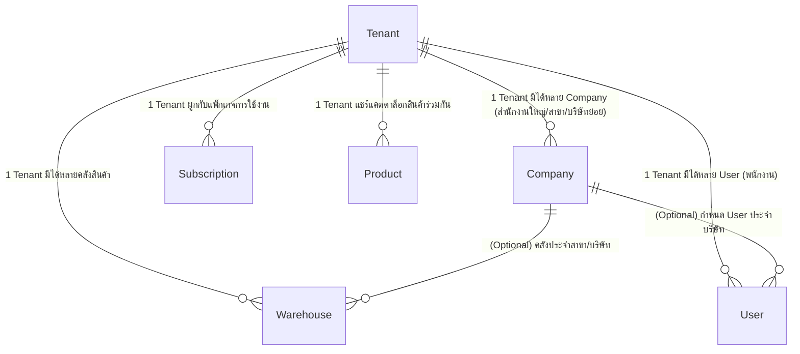
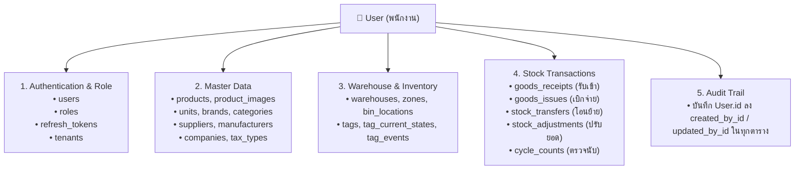

# MatchStock — Tenant, Company, User & Subscription Architecture

เอกสารนี้รวบรวมข้อสรุปโครงสร้างความสัมพันธ์ระหว่าง **Tenant, Company, User**, ตารางที่เกี่ยวข้องในระบบ, และ**แผนการจัดทำ Subscription Packages (Free, Pro, Ultra)** สำหรับ MatchStock (WMS & Inventory Management Platform)

---

## 1. ความสัมพันธ์ระหว่าง Tenant, Company, และ User

ระบบ MatchStock ออกแบบสถาปัตยกรรมเป็นแบบ **Multi-tenancy (Data Isolation by `tenant_id`)**



### รายละเอียดของแต่ละ Entity:

1. **`Tenant` (ระดับองค์กร/บัญชีลูกค้าสูงสุด — Root Boundary)**
   - เป็นขอบเขตหลักในการแบ่งแยกข้อมูล ทุกตารางในระบบจะผูกกับ `tenant_id`
   - เป็นคู่สัญญา/เจ้าของบัญชีที่ชำระค่าบริการ (`Subscription`), เป็นเจ้าของ Master Data กลาง เช่น สินค้า (`Product`), หมวดหมู่, หน่วยนับ (`Unit`), ยี่ห้อ (`Brand`)

2. **`Company` (นิติบุคคล / สาขา / บริษัทย่อย — Business Entity)**
   - อยู่ใต้ `Tenant` (`Tenant 1 : N Company`) มีฟิลด์ระบุสาขา เช่น `taxId`, `branchCode`, `branchName`, `isHeadquarter`, `address`
   - รองรับลูกค้า 1 องค์กรที่มีหลายบริษัทในเครือ หรือมีหลายสาขา โดยใช้ Master Data สินค้าร่วมกันได้ในระดับ Tenant เดียวกัน

3. **`User` (ผู้ใช้งานระบบ — Staff / Operators)**
   - ผูกตรงกับ `Tenant` (`tenant_id`) และมีบทบาท (`role` เช่น `owner`, `admin`, `manager`, `warehouse_staff`, `operator`)
   - **ระดับการมองเห็นข้อมูล**:
     - *Tenant Scope (ปัจจุบัน)*: ผู้ใช้ที่สร้างขึ้นสามารถเข้าถึงข้อมูลของ Tenant นั้นๆ ได้ตามสิทธิ์ของ Role
     - *Company Scope (ส่วนต่อขยาย)*: เพิ่ม `User.companyId` เพื่อจำกัดให้เห็นเฉพาะธุรกรรม/คลังของสาขาตนเอง (`null` = ดูได้ทุกสาขา)

---

## 2. โครงสร้างตาราง `users` และ Table ที่ User ใช้งาน

### 2.1 โครงสร้างตาราง `users` (`backend/prisma/schema.prisma`)

| ชื่อฟิลด์ (Column Name) | ชนิดข้อมูล | Constraints / Default | คำอธิบาย |
|---|---|---|---|
| `id` | `UUID` | Primary Key (`default: uuid()`) | รหัสประจำตัว User |
| `tenant_id` | `UUID` | Not Null, FK -> `tenants.id` | รหัส Tenant ที่สังกัด |
| `email` | `VARCHAR(255)` | Not Null, **Unique** | อีเมลสำหรับ Login |
| `password_hash` | `VARCHAR(255)` | Not Null | รหัสผ่านที่เข้ารหัสแล้ว (Hash) |
| `full_name` | `VARCHAR(255)` | Not Null | ชื่อ-นามสกุลของผู้ใช้งาน |
| `role` | `VARCHAR(50)` | Not Null, FK -> `roles.code` | บทบาทสิทธิ์ (`owner`, `admin`, `operator` ฯลฯ) |
| `is_active` | `BOOLEAN` | `default: true` | สถานะเปิด/ปิดการใช้งานบัญชี |
| `last_login_at` | `TIMESTAMP` | Nullable | เวลาที่เข้าสู่ระบบล่าสุด |
| `failed_login_attempts` | `INTEGER` | `default: 0` | จำนวนครั้งที่ล็อกอินล้มเหลว |
| `locked_until` | `TIMESTAMP` | Nullable | เวลาที่ปลดล็อกบัญชี |
| `created_by_type` / `id` | `VARCHAR(20)` / `UUID` | Nullable | ข้อมูลผู้สร้างรายการ |
| `updated_by_type` / `id` | `VARCHAR(20)` / `UUID` | Nullable | ข้อมูลผู้แก้ไขล่าสุด |
| `deleted_at` / `type` / `id` | `TIMESTAMP` / ... | Nullable | ข้อมูลการ Soft Delete |
| `created_at` / `updated_at` | `TIMESTAMP` | `now()` / Auto-update | เวลาสร้างและแก้ไขล่าสุด |

### 2.2 Table ที่ `User` ใช้งานในระบบ



---

## 3. แผนระบบ Subscription Packages (Free, Pro, Ultra)

### 3.1 ตารางเปรียบเทียบแพ็กเกจ (Subscription Matrix)

| คุณสมบัติ / โควตา | 🥉 Free (Starter) | 🥈 Pro (Professional) | 🥇 Ultra (Enterprise RFID) |
|---|---|---|---|
| **กลุ่มเป้าหมาย** | ร้านค้าปลีก/SME จัดการสต็อกเบื้องต้น | ธุรกิจหลายคลัง ต้องการคุม Lot/FEFO | คลังสินค้า/โรงงาน ใช้ RFID & Automation |
| **ราคาแนะนำ** | **฿0** / เดือน (ตลอดชีพ) | **฿1,490 – 2,490** / เดือน | **฿5,990 – 9,990** / เดือน |
| **จำนวนผู้ใช้งาน (`maxUsers`)** | สูงสุด **2 คน** | สูงสุด **10 คน** | **ไม่จำกัด** (หรือ 30+ คน) |
| **จำนวนคลังสินค้า (`maxWarehouses`)** | **1 คลัง** (ไม่มี Bin) | สูงสุด **3 คลัง** (พร้อม Bin Location) | **ไม่จำกัดคลัง** (Multi-Warehouse & Bin) |
| **บริษัท/สาขา (`maxCompanies`)** | **1 บริษัท** | สูงสุด **3 บริษัทในเครือ** | **ไม่จำกัดบริษัทย่อย/สาขา** |
| **จำนวนรายการสินค้า (`maxProducts`)** | **500 SKUs** | **10,000 SKUs** | **ไม่จำกัด SKUs** |
| **อุปกรณ์ RFID (`maxDevices`)** | 0 | 0 | **10+ เครื่อง** (พร้อมรองรับเพิ่ม) |

---

### 3.2 รายละเอียดฟังก์ชันในแต่ละแพ็กเกจ

#### 🥉 1. แผน Free (Starter Tier)
* **ฟังก์ชันการทำงาน:**
  * บันทึกรับเข้า (Goods Receipt) และเบิกจ่าย (Goods Issue) แบบ Manual
  * ตัดสต็อกแบบนับจำนวนทั่วไป (Quantity-based)
  * สแกนและสร้างบาร์โค้ดมาตรฐาน (`CODE128`, `EAN13`, `QR Code`)
  * แจ้งเตือนสินค้าใกล้หมด (Reorder Point Alert)
  * ดูรายงานพื้นฐาน: ประวัติสต็อกการเคลื่อนไหว (Stock Card)
  * นำเข้า-ส่งออกข้อมูลสินค้าผ่าน Excel / CSV
* **ข้อจำกัด:**
  * ❌ ไม่รองรับการคุม Lot / วันหมดอายุ (No FEFO / Lot Tracking)
  * ❌ ไม่รองรับระบบ RFID / Virtual Tag
  * ❌ ไม่มีระบบใบนับสต็อกรอบใหญ่ (Cycle Count)
  * ❌ ใช้งานได้เพียง 1 คลัง และไม่มีตำแหน่งจัดเก็บย่อย (Bin Location)

#### 🥈 2. แผน Pro (Professional Tier)
* **ฟังก์ชันการทำงาน (รวมทุกอย่างใน Free + เพิ่มเติม):**
  * **Lot / Batch & Expiry Tracking**: บันทึก Lot No., วันผลิต, วันหมดอายุ
  * **FEFO / FIFO Engine**: ระบบแนะนำหยิบสินค้าที่ใกล้หมดอายุก่อนอัตโนมัติ
  * **Multi-Warehouse & Bin Locations**: โอนย้ายสินค้าระหว่างคลัง และระบุชั้นวาง/ช่องเก็บ (Bin-to-Bin)
  * **Cycle Count (Barcode)**: สร้างใบนับสต็อกตามรอบ ตรวจนับด้วยการสแกนบาร์โค้ด คำนวณยอดดิฟ (Variance)
  * **Sales Order (SO)**: สร้างใบสั่งขาย จองสต็อก (Reserve) และตัดจ่ายแยกตามคลัง
  * **Advanced Reports**:
    * รายงานสินค้าใกล้หมดอายุ (Expiring Soon Report)
    * รายงานการหมุนเวียนสินค้า (Fast/Slow Moving Analysis)
    * รายงานมูลค่าสินค้าคงเหลือ (Stock Valuation ตามต้นทุนจริง)
  * **Multi-Branch (3 สาขา)**: แยกข้อมูลคลังสินค้าตามบริษัทย่อยได้

#### 🥇 3. แผน Ultra (Enterprise / RFID Automation Tier)
* **ฟังก์ชันการทำงาน (รวมทุกอย่างใน Pro + เพิ่มเติม):**
  * **RFID Full Integration**:
    * สแกนและตรวจนับสินค้าเป็นพันชิ้นในไม่กี่วินาทีด้วยเครื่องอ่าน RFID (Fixed Reader / Handheld)
    * ระบบ **Cycle Count แบบผสม (Hybrid RFID + Barcode)** พร้อมระบบ Reconcile สินค้าสูญหาย
    * รองรับ Real-time Tag Tracking & Missing Detector (แจ้งเตือนสินค้าหายจากจุดสแกน)
  * **Custom Role & Dynamic RBAC**: กำหนดสิทธิ์การเข้าถึงเมนูและปุ่มกดของพนักงานได้อย่างอิสระ
  * **Hardware Telemetry & Middleware (MQTT)**: เชื่อมต่อเครื่องอ่าน RFID/เสาประตูคลังผ่าน MQTT แบบ Real-time
  * **Developer API & Webhooks**: เปิดใช้ REST API และระบบ Webhook ส่งข้อมูลเข้า ERP / POS / E-Commerce ภายนอก
  * **Hardware Rental Option**: สิทธิ์เช่าอุปกรณ์ RFID Handheld / Fixed Reader พร้อมบริการซ่อมบำรุง
  * **Dedicated Support & SLA**: ทีมซัพพอร์ตดูแลด่วน 24/7

---

### 3.3 ข้อมูลเริ่มต้นสำหรับตาราง `subscription_plans` (Seed Data)

```json
[
  {
    "code": "FREE",
    "name": "MatchStock Free",
    "type": "web",
    "billingCycle": "monthly",
    "priceMinor": 0,
    "maxUsers": 2,
    "maxWarehouses": 1,
    "maxProducts": 500,
    "maxDevices": 0,
    "features": [
      "products.basic",
      "stock.gr_gi",
      "barcode.scan",
      "reports.stock_card",
      "import_export.basic"
    ]
  },
  {
    "code": "PRO_MONTHLY",
    "name": "MatchStock Pro",
    "type": "web",
    "billingCycle": "monthly",
    "priceMinor": 199000,
    "maxUsers": 10,
    "maxWarehouses": 3,
    "maxProducts": 10000,
    "maxDevices": 0,
    "features": [
      "products.basic",
      "stock.gr_gi",
      "barcode.scan",
      "reports.stock_card",
      "import_export.basic",
      "warehouse.bins",
      "stock.lot_expiry",
      "stock.fefo",
      "stock.transfer",
      "stock.adjustment",
      "cycle_count.barcode",
      "sales_orders.manage",
      "reports.valuation",
      "reports.moving_analysis",
      "reports.expiring_soon",
      "company.multi_branch"
    ]
  },
  {
    "code": "ULTRA_MONTHLY",
    "name": "MatchStock Ultra (RFID)",
    "type": "web",
    "billingCycle": "monthly",
    "priceMinor": 699000,
    "maxUsers": 9999,
    "maxWarehouses": 9999,
    "maxProducts": 999999,
    "maxDevices": 10,
    "features": [
      "products.basic",
      "stock.gr_gi",
      "barcode.scan",
      "reports.stock_card",
      "import_export.basic",
      "warehouse.bins",
      "stock.lot_expiry",
      "stock.fefo",
      "stock.transfer",
      "stock.adjustment",
      "cycle_count.barcode",
      "sales_orders.manage",
      "reports.valuation",
      "reports.moving_analysis",
      "reports.expiring_soon",
      "company.multi_branch",
      "rfid.tags",
      "rfid.telemetry",
      "cycle_count.rfid_hybrid",
      "hardware.mqtt_devices",
      "rbac.custom_roles",
      "integrations.webhooks",
      "integrations.api_access"
    ]
  }
]
```

---

## 4. กลไกการบังคับใช้ Subscription ในระบบ (Enforcement Architecture)

1. **Entitlement Guard (`EntitlementGuard`)**:
   - ตรวจสอบสถานะของ Subscription ระดับ Tenant ว่าเป็น `active` หรืออยู่ใน `trial` หรือไม่
   - ตรวจสอบว่า `SubscriptionPlan.features` มี Feature Code ที่ Endpoint นั้นๆ ต้องการหรือไม่ผ่าน `@RequireFeature('feature.code')`
2. **Quota Check ก่อน Create Resource**:
   - เมื่อสร้าง User ใหม่ -> เช็ค `COUNT(users) < maxUsers`
   - เมื่อสร้าง Warehouse ใหม่ -> เช็ค `COUNT(warehouses) < maxWarehouses`
   - เมื่อสร้าง Product ใหม่ -> เช็ค `COUNT(products) < maxProducts`
   - หากเกินโควตา จะส่ง Response `403 Quota Exceeded` พร้อมแนะนำให้อัปเกรดแพ็กเกจ
3. **Dynamic Menu Rendering**:
   - หน้า Frontend ดึงรายการ Features ที่ Tenant ปัจจุบันได้รับสิทธิ์เพื่อนำมาแสดง/ซ่อนเมนูนำทาง (`MenuItem.requiredFeature`) อัตโนมัติ
